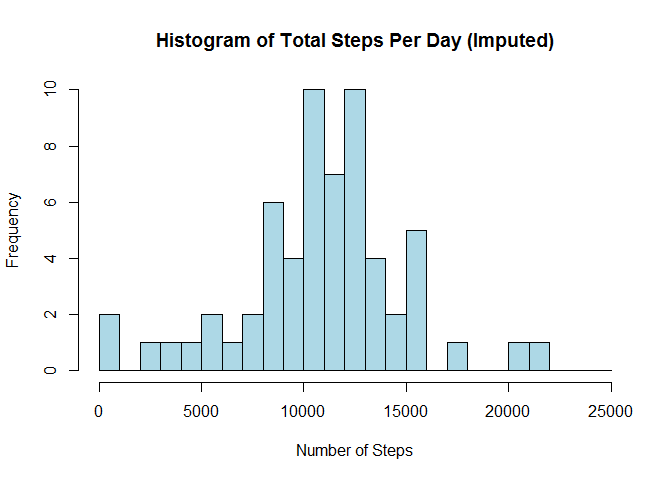

# Reproducible Research: Peer Assessment 1
## Introduction

It is now possible to collect a large amount of data about personal movement using activity monitoring devices such as a [Fitbit](http://www.fitbit.com), [Nike Fuelband](http://http://www.nike.com/us/en_us/c/nikeplus-fuel), or [Jawbone Up](https://jawbone.com/up). These type of devices are part of the "quantified self" movement - a group of enthusiasts who take measurements about themselves regularly to improve their health, to find patterns in their behavior, or because they are tech geeks. But these data remain under-utilized both because the raw data are hard to obtain and there is a lack of statistical methods and software for processing and interpreting the data.

This assignment makes use of data from a personal activity monitoring device. This device collects data at 5 minute intervals through out the day. The data consists of two months of data from an anonymous individual collected during the months of October and November, 2012 and include the number of steps taken in 5 minute intervals each day.

## Data

The data for this assignment can be downloaded from the course web site:

* Dataset: [Activity monitoring data](https://d396qusza40orc.cloudfront.net/repdata%2Fdata%2Factivity.zip) [52K]
The variables included in this dataset are:

* __steps__: Number of steps taking in a 5-minute interval (missing values are coded as ```NA```)

* __date__: The date on which the measurement was taken in YYYY-MM-DD format

* __interval__: Identifier for the 5-minute interval in which measurement was taken

The dataset is stored in a comma-separated-value (CSV) file and there are a total of 17,568 observations in this dataset.

## Assignment

This assignment will be described in multiple parts. You will need to write a report that answers the questions detailed below. Ultimately, you will need to complete the entire assignment in a __single R markdown__ document that can be processed by knitr and be transformed into an HTML file.

Throughout your report make sure you always include the code that you used to generate the output you present. When writing code chunks in the R markdown document, always use ```echo = TRUE``` so that someone else will be able to read the code. __This assignment will be evaluated via peer assessment so it is essential that your peer evaluators be able to review the code for your analysis.__

For the plotting aspects of this assignment, feel free to use any plotting system in R (i.e., base, lattice, ggplot2).

Fork/clone the [GitHub repository created for this assignment](http://github.com/rdpeng/RepData_PeerAssessment1). You will submit this assignment by pushing your completed files into your forked repository on GitHub. The assignment submission will consist of the URL to your GitHub repository and the SHA-1 commit ID for your repository state.

NOTE: The GitHub repository also contains the dataset for the assignment so you do not have to download the data separately.

## Loading and preprocessing the data

Show any code that is needed to

1. Load the data (i.e. ```read.csv()```)
    
    ```r
    require(dplyr)  ## used for data manipulation further down
    ```
    
    ```
    ## Loading required package: dplyr
    ## 
    ## Attaching package: 'dplyr'
    ## 
    ## The following object is masked from 'package:stats':
    ## 
    ##     filter
    ## 
    ## The following objects are masked from 'package:base':
    ## 
    ##     intersect, setdiff, setequal, union
    ```
    
    ```r
    require(lattice)
    ```
    
    ```
    ## Loading required package: lattice
    ```
    
    ```r
    options(scipen = 999) ## remove scientific notation
    
    # First set working directory
    setwd("d:/Coursera/Reproducible Research/Peer Assessments/1")
    
    activity <- read.csv("activity.csv", stringsAsFactors = FALSE)
    ```

2. Process/transform the data (if necessary) into a format suitable for your analysis
    
    ```r
    # Cast date as POSIXct, not just character data
    activity$date <- as.POSIXct(activity$date, format = "%Y-%m-%d")
    
    # We will need day of week and part of week later
    activity <- data.frame(date = activity$date,
                           weekday = weekdays(activity$date, abbreviate = TRUE),
                           weekpart = ifelse(weekdays(activity$date, abbreviate = TRUE) %in% 
                                             c("Sat", "Sun"), "Weekend", "Weekday"),
                           steps = activity$steps,
                           interval = as.integer(activity$interval))
    
    # Transform weekday into factor for ordering summary toward the bottom of our analysis
    activity$weekday <- factor(activity$weekday, levels = 
                                   c("Mon", "Tue", "Wed", "Thu", "Fri", "Sat", "Sun"))
    
    # Inspect data frame to ensure proper casting and calculations
    summary(activity)
    ```
    
    ```
    ##       date                     weekday       weekpart         steps       
    ##  Min.   :2012-10-01 00:00:00   Mon:2592   Weekday:12960   Min.   :  0.00  
    ##  1st Qu.:2012-10-16 00:00:00   Tue:2592   Weekend: 4608   1st Qu.:  0.00  
    ##  Median :2012-10-31 00:00:00   Wed:2592                   Median :  0.00  
    ##  Mean   :2012-10-31 00:25:34   Thu:2592                   Mean   : 37.38  
    ##  3rd Qu.:2012-11-15 00:00:00   Fri:2592                   3rd Qu.: 12.00  
    ##  Max.   :2012-11-30 00:00:00   Sat:2304                   Max.   :806.00  
    ##                                Sun:2304                   NA's   :2304    
    ##     interval     
    ##  Min.   :   0.0  
    ##  1st Qu.: 588.8  
    ##  Median :1177.5  
    ##  Mean   :1177.5  
    ##  3rd Qu.:1766.2  
    ##  Max.   :2355.0  
    ## 
    ```

## What is mean total number of steps taken per day?

For this part of the assignment, you can ignore the missing values in the dataset.

1. Calculate the total number of steps taken per day
    
    ```r
    average.steps.per.day <- aggregate(activity$steps ~ activity$date, FUN = sum, na.rm = TRUE)
    names(average.steps.per.day) <- c("date", "steps")
    
    # Take a quick look to understand the min and max for the histogram
    summary(average.steps.per.day)
    ```
    
    ```
    ##       date                         steps      
    ##  Min.   :2012-10-02 00:00:00   Min.   :   41  
    ##  1st Qu.:2012-10-16 00:00:00   1st Qu.: 8841  
    ##  Median :2012-10-29 00:00:00   Median :10765  
    ##  Mean   :2012-10-30 17:37:21   Mean   :10766  
    ##  3rd Qu.:2012-11-16 00:00:00   3rd Qu.:13294  
    ##  Max.   :2012-11-29 00:00:00   Max.   :21194
    ```
    
    __Summarized in 3 below.__

2. If you do not understand the difference between a histogram and a barplot, research the difference between them. Make a histogram of the total number of steps taken each day
    
    ```r
    hist(average.steps.per.day$steps, 
         breaks = seq(from = 0, to = 25000, by = 1000), 
         col = "lightblue", 
         xlab = "Number of Steps", 
         main = "Histogram of Total Steps Per Day")
    ```
    
     

3. Calculate and report the mean and median of the total number of steps taken per day
    
    ```r
    average.steps.per.day.mean <- round(mean(average.steps.per.day$steps), 0)
    average.steps.per.day.median <- round(median(average.steps.per.day$steps), 0)
    
    average.steps.per.day.mean
    ```
    
    ```
    ## [1] 10766
    ```
    __So, the mean steps taken per day is 10766.__
    
    ```r
    average.steps.per.day.median
    ```
    
    ```
    ## [1] 10765
    ```
    __So, the median steps taken per day is 10765.__

## What is the average daily activity pattern?

1. Make a time series plot (i.e. ```type = "l"```) of the 5-minute interval (x-axis) and the average number of steps taken, averaged across all days (y-axis)
    
    ```r
    average.steps.per.interval <- aggregate(activity$steps ~ activity$interval, FUN = mean, na.rm = TRUE)
    names(average.steps.per.interval) <- c("interval", "steps")
    
    plot(average.steps.per.interval$interval, average.steps.per.interval$steps, type = "l", 
         xlab = "5-Minute Interval of Day (Morning to Evening, Left to Right, Respectively)", 
         ylab = "Average Number of Steps",
         main = "Avg. Steps Taken (in 5-Minute Intervals) Averaged Across All Days",
         col = "blue")
    axis(side = 1, at = seq(0, 2500, by = 250))
    ```
    
     

2. Which 5-minute interval, on average across all the days in the dataset, contains the maximum number of steps?
    
    ```r
    max.average.interval <- average.steps.per.interval[(average.steps.per.interval$steps == 
                                                            max(average.steps.per.interval$steps)), 1]
    
    max.average.interval
    ```
    
    ```
    ## [1] 835
    ```
    __The 5-minute interval that, on average across all days in the dataset, has the maximum number of steps is 835.  Looking at the plot above you can check the face-validity of this answer as well.__

## Imputing missing values

Note that there are a number of days/intervals where there are missing values (coded as ```NA```). The presence of missing days may introduce bias into some calculations or summaries of the data.

1. Calculate and report the total number of missing values in the dataset (i.e. the total number of rows with ```NA```s)
    
    ```r
    missing.count <- sum(is.na(activity$steps))
    
    missing.count
    ```
    
    ```
    ## [1] 2304
    ```
    __So, the total number of missing values in the dataset is 2304.__
    
2. Devise a strategy for filling in all of the missing values in the dataset. The strategy does not need to be sophisticated. For example, you could use the mean/median for that day, or the mean for that 5-minute interval, etc.
    
    ```r
    # First, capture the indexes of the missing values
    
    missing.indexes <- which(is.na(activity$steps))
    ```
    __Now let's take a look at the meta-data where we're missing metrics.__
    
    ```r
    # Now let's inspect a few summary statistics about the missing data.
    
    summary(activity[(missing.indexes),])
    ```
    
    ```
    ##       date                     weekday      weekpart        steps     
    ##  Min.   :2012-10-01 00:00:00   Mon:576   Weekday:1728   Min.   : NA   
    ##  1st Qu.:2012-10-26 00:00:00   Tue:  0   Weekend: 576   1st Qu.: NA   
    ##  Median :2012-11-06 11:30:00   Wed:288                  Median : NA   
    ##  Mean   :2012-11-01 21:30:00   Thu:288                  Mean   :NaN   
    ##  3rd Qu.:2012-11-11 00:00:00   Fri:576                  3rd Qu.: NA   
    ##  Max.   :2012-11-30 00:00:00   Sat:288                  Max.   : NA   
    ##                                Sun:288                  NA's   :2304  
    ##     interval     
    ##  Min.   :   0.0  
    ##  1st Qu.: 588.8  
    ##  Median :1177.5  
    ##  Mean   :1177.5  
    ##  3rd Qu.:1766.2  
    ##  Max.   :2355.0  
    ## 
    ```
    
    ```r
    unique(activity$weekday[(missing.indexes)])
    ```
    
    ```
    ## [1] Mon Thu Sun Fri Sat Wed
    ## Levels: Mon Tue Wed Thu Fri Sat Sun
    ```
    
    ```r
    unique(activity$date[(missing.indexes)])
    ```
    
    ```
    ## [1] "2012-10-01 EDT" "2012-10-08 EDT" "2012-11-01 EDT" "2012-11-04 EDT"
    ## [5] "2012-11-09 EST" "2012-11-10 EST" "2012-11-14 EST" "2012-11-30 EST"
    ```
    
    ```r
    weekdays(unique(activity$date[(missing.indexes)]), abbreviate = TRUE)
    ```
    
    ```
    ## [1] "Mon" "Mon" "Thu" "Sun" "Fri" "Sat" "Wed" "Fri"
    ```
    __So, these summaries tell us that we're missing the following:__
    * __Eight (8) complete days (no metrics whatsoever)__
    * __Those eight days include two Mondays, no Tuesday, one Wednesday, one Thursday, two Fridays, one Saturday, one Sunday__


    __Ok, I'm going with substituting average steps by weekday by interval to keep the formula fairly straight-forward.__
    
    ```r
    # Take activity, group by weekday and interval and then average the steps
    average.steps.per.weekday.per.interval <- activity %>% 
        group_by(weekday, interval) %>% 
        summarize(mean.steps = mean(steps, na.rm = TRUE))
    names(average.steps.per.weekday.per.interval) <- c("weekday", "interval", "steps")
    
    # Cast steps to an integer for whole numbers
    average.steps.per.weekday.per.interval$steps <- 
        as.integer(average.steps.per.weekday.per.interval$steps)
    ```
    __Let's take a look to see if the summary of activity.day passes a litmus test.__
    
    ```r
    summary(average.steps.per.weekday.per.interval)
    ```
    
    ```
    ##  weekday      interval          steps       
    ##  Mon:288   Min.   :   0.0   Min.   :  0.00  
    ##  Tue:288   1st Qu.: 588.8   1st Qu.:  0.00  
    ##  Wed:288   Median :1177.5   Median : 12.00  
    ##  Thu:288   Mean   :1177.5   Mean   : 37.44  
    ##  Fri:288   3rd Qu.:1766.2   3rd Qu.: 55.00  
    ##  Sat:288   Max.   :2355.0   Max.   :328.00  
    ##  Sun:288
    ```
    __So, we now have an "averaged" dataset for each day so that we can substitute this data for the missing data.__

3. Create a new dataset that is equal to the original dataset but with the missing data filled in.
    
    ```r
    # Let's merge the two data frames.  activity will be the "x" and
    # average.steps.per.weekday.per.interval will be the "y"
    activity.imputed <- merge(activity, average.steps.per.weekday.per.interval, 
                              by = c("weekday", "interval"))
    
    # Fill in the NAs with imputed values
    activity.imputed$imputed.steps <- ifelse(is.na(activity.imputed$steps.x), 
                                             activity.imputed$steps.y, 
                                             activity.imputed$steps.x)
    
    # Transform activity.imputed data frame to match structure of activity data frame
    # purely for comparison
    activity.imputed <- data.frame(date = activity.imputed$date,
                                   weekday = activity.imputed$weekday,
                                   weekpart = activity$weekpart,
                                   steps = activity.imputed$imputed.steps,
                                   interval = activity.imputed$interval)
    
    # Let's take a look 
    summary(activity)
    ```
    
    ```
    ##       date                     weekday       weekpart         steps       
    ##  Min.   :2012-10-01 00:00:00   Mon:2592   Weekday:12960   Min.   :  0.00  
    ##  1st Qu.:2012-10-16 00:00:00   Tue:2592   Weekend: 4608   1st Qu.:  0.00  
    ##  Median :2012-10-31 00:00:00   Wed:2592                   Median :  0.00  
    ##  Mean   :2012-10-31 00:25:34   Thu:2592                   Mean   : 37.38  
    ##  3rd Qu.:2012-11-15 00:00:00   Fri:2592                   3rd Qu.: 12.00  
    ##  Max.   :2012-11-30 00:00:00   Sat:2304                   Max.   :806.00  
    ##                                Sun:2304                   NA's   :2304    
    ##     interval     
    ##  Min.   :   0.0  
    ##  1st Qu.: 588.8  
    ##  Median :1177.5  
    ##  Mean   :1177.5  
    ##  3rd Qu.:1766.2  
    ##  Max.   :2355.0  
    ## 
    ```
    
    ```r
    summary(activity.imputed)
    ```
    
    ```
    ##       date                     weekday       weekpart         steps       
    ##  Min.   :2012-10-01 00:00:00   Mon:2592   Weekday:12960   Min.   :  0.00  
    ##  1st Qu.:2012-10-16 00:00:00   Tue:2592   Weekend: 4608   1st Qu.:  0.00  
    ##  Median :2012-10-31 00:00:00   Wed:2592                   Median :  0.00  
    ##  Mean   :2012-10-31 00:25:34   Thu:2592                   Mean   : 37.53  
    ##  3rd Qu.:2012-11-15 00:00:00   Fri:2592                   3rd Qu.: 19.00  
    ##  Max.   :2012-11-30 00:00:00   Sat:2304                   Max.   :806.00  
    ##                                Sun:2304                                   
    ##     interval     
    ##  Min.   :   0.0  
    ##  1st Qu.: 588.8  
    ##  Median :1177.5  
    ##  Mean   :1177.5  
    ##  3rd Qu.:1766.2  
    ##  Max.   :2355.0  
    ## 
    ```
    
    ```r
    head(activity.imputed)
    ```
    
    ```
    ##         date weekday weekpart steps interval
    ## 1 2012-10-19     Fri  Weekday     0        0
    ## 2 2012-10-05     Fri  Weekday     0        0
    ## 3 2012-11-30     Fri  Weekday     0        0
    ## 4 2012-10-12     Fri  Weekday     0        0
    ## 5 2012-11-16     Fri  Weekday     0        0
    ## 6 2012-10-26     Fri  Weekday     0        0
    ```

4. Make a histogram of the total number of steps taken each day and Calculate and report the mean and median total number of steps taken per day. Do these values differ from the estimates from the first part of the assignment? What is the impact of imputing missing data on the estimates of the total daily number of steps?
    
    ```r
    imputed.average.steps.per.day <- aggregate(activity.imputed$steps ~ activity.imputed$date, 
                                       FUN = sum, na.rm = TRUE)
    
    names(imputed.average.steps.per.day) <- c("date", "steps")
    
    hist(imputed.average.steps.per.day$steps, 
         breaks = seq(from = 0, to = 25000, by = 1000), 
         col = "lightblue", 
         xlab = "Number of Steps", 
         main = "Histogram of Total Steps Per Day (Imputed)")
    ```
    
     
    
    ```r
    imputed.average.steps.per.day.mean <- round(mean(imputed.average.steps.per.day$steps), 0)
    imputed.average.steps.per.day.median <- round(median(imputed.average.steps.per.day$steps), 0)
    
    imputed.average.steps.per.day.mean
    ```
    
    ```
    ## [1] 10810
    ```
    __So, the mean for the imputed data is 10810 versus the original mean of 10766.__
    
    ```r
    imputed.average.steps.per.day.median
    ```
    
    ```
    ## [1] 11015
    ```
    __So, the median for the imputed data is 11015 versus the orignal median of 10765.__
        
    __Let's now compare the activity data with the imputed activity data.__
    
    ```r
    activity.steps.per.weekday <- activity %>% 
        group_by(date, weekday) %>% 
        summarize(total.steps = sum(steps)) %>% 
        group_by(weekday) %>% 
        summarize(average.steps = round(mean(total.steps, na.rm = TRUE), 0))
    
    activity.imputed.steps.per.weekday <- activity.imputed %>% 
        group_by(date, weekday) %>% 
        summarize(total.steps = sum(steps)) %>% 
        group_by(weekday) %>% 
        summarize(average.steps = round(mean(total.steps, na.rm = TRUE), 0))
    
    activity.steps.per.weekday
    ```
    
    ```
    ## Source: local data frame [7 x 2]
    ## 
    ##   weekday average.steps
    ## 1     Mon          9975
    ## 2     Tue          8950
    ## 3     Wed         11791
    ## 4     Thu          8213
    ## 5     Fri         12360
    ## 6     Sat         12535
    ## 7     Sun         12278
    ```
    
    ```r
    activity.imputed.steps.per.weekday
    ```
    
    ```
    ## Source: local data frame [7 x 2]
    ## 
    ##   weekday average.steps
    ## 1     Mon          9956
    ## 2     Tue          8950
    ## 3     Wed         11782
    ## 4     Thu          8203
    ## 5     Fri         12341
    ## 6     Sat         12524
    ## 7     Sun         12266
    ```
    __Importantly, we notice that Tuesday's average steps has not changed.  Remember, we were not missing data for Tuesday so that makes sense.__

## Are there differences in activity patterns between weekdays and weekends?

For this part the ```weekdays()``` function may be of some help here. Use the dataset with the filled-in missing values for this part.

1. Create a new factor variable in the dataset with two levels - "weekday" and "weekend" indicating whether a given date is a weekday or weekend day.
    
    __Fortunately, I created the two-level factor, weekpart, when I created the data frames.__
    
2. Make a panel plot containing a time series plot (i.e. ```type = "l"```) of the 5-minute interval (x-axis) and the average number of steps taken, averaged across all weekday days or weekend days (y-axis). See the README file in the GitHub repository to see an example of what this plot should look like using simulated data.
    
    ```r
    activity.imputed.steps.per.weekpart <- activity.imputed %>% group_by(weekpart, interval) %>% summarize(average.steps = mean(steps))
    
    xyplot(average.steps ~ interval | weekpart, data = activity.imputed.steps.per.weekpart,
       type = "l", layout = c(1, 2), 
       xlab = "5-Minute Interval of Day (Morning to Evening, Left to Right, Respectively)",
       ylab = "Average Number of Steps",
       main = "Avg. Steps Taken (in 5-Minute Intervals) Averaged By Week Part")
    ```
    
     
    
    __As you can see by the comparison of Weekend versus Weekday, activity starts later and ends later on the weekends and appears more evenly distributed throughout the day during the weekends.  If I were to make an assumption that this data came from an individual that works Monday through Friday, this makes sense.  If you consider that someone working during the week will not typically be as active (in terms of steps taken) Monday through Friday because he/she will be in meetings or sitting at a desk.__
